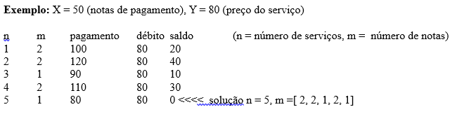

# Fechamento de Ciclo de Pagamento Discreto

# Campo
Teoria dos Números e Matemática Discreta 

# Grupo de Pesquisa Afim
nenhum

# Contexto
Um prestador de serviços cobra Y por seus serviços, mas o recebedor do serviço somente pode pagar com notas de valor X < Y e o recebedor não tem como dar o troco. A solução acordada foi, que como o serviço é periódico, o recebedor dos serviços nunca pagará menos que o preço Y combinado, mas que o excesso fica como saldo para o próximo pagamento.

# Objetivo
1. Determinar se após um determinado número de serviços, o saldo fica zerado.
2. Em caso positivo, planejar quantas notas precisam ser pagas em cada serviço.

# Exemplo

# Dificuldades
Nenhuma

# Dicas
1. É o mesmo tipo que o problema de Josephus.
2. O problema de determinar n (número de serviços) pode ser resolvido de forma independente sem determinar a sequência de notas que precisam ser pagas em cada serviço (2a coluna). Contudo, é mais eficiente resolver os dois problemas ao mesmo tempo.