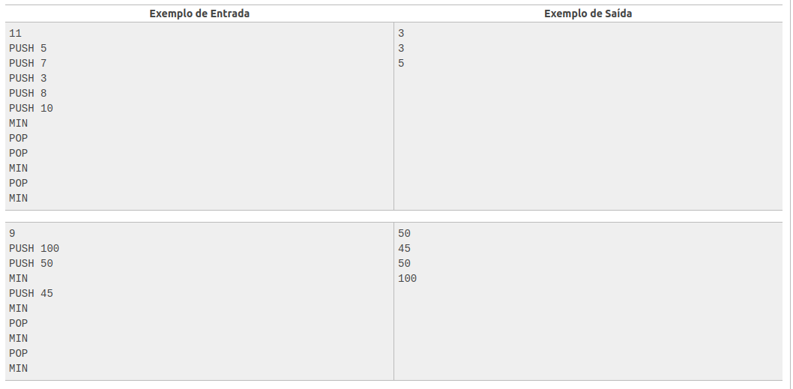

# Menor da Pilha
Todo Natal o bom velhinho consegue ir em todas as casas do mundo e deixar presentes para as crianças que foram boazinhas ao longo do ano, mas isso só é possível por causa do seu saco mágico de presentes. Seria impossível para o Papai Noel levar todos os presentes no seu saco, o volume e peso de todos eles torna isso obviamente inviável. O que acontece na verdade é que seu saco é uma espécie de portal mágico para sua fábrica de presentes no Polo Norte. Onde os presentes são empilhados pelos seus elfos e o Noel tira sempre o presente do topo dessa pilha quando acessa sua sacola mágica.

Os presentes possuem uma medição numérica do grau de diversão que podem proporcionar às crianças e o Papai Noel tem sempre a preocupação de saber qual o presente menos divertido que ele irá entregar ao longo da noite porque ele não quer que nenhuma criança se sinta mal com o que receber. Porém, isso não é possível de ser feito antecipadamente porque ao longo da noite enquanto o bom velhinho retira presentes da pilha para entregar, ainda estão sendo feitos outros e colocados na pilha. Então o máximo que ele pode saber é o valor do presente menos divertido na pilha até aquele momento.

Sua tarefa é, dado a sequência de operações feitas sobre a pilha de presentes, responder as consultas do Papai Noel sobre o valor do presente menos divertido na pilha até o momento.

## Entrada
A primeira linha da entrada contém um inteiro N (1 ≤ N ≤ 106) correspondedendo ao número de operações feitas sobre a pilha de presentes. As operações podem ser de três tipos: "PUSH V" onde V (1 ≤ V ≤ 109) é um inteiro que representa o grau de diversão do presente sendo colocado na pilha; "POP" que representa que o papai Noel está tirando um presente da pilha para entregar e "MIN" que representa uma consulta do Noel para saber o menor valor de presente na pilha.

## Saída
A saída consiste em uma linha contendo um inteiro com o menor valor de presente na pilha para as consultas do tipo "MIN" ou a mensagem "EMPTY" para as operações "MIN" e "POP" quando a pilha estiver vazia.

